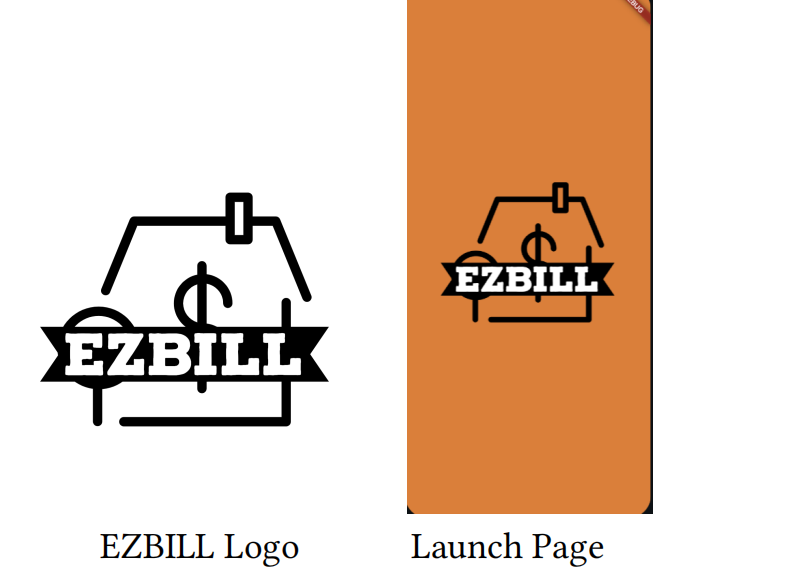

# EZBILL

A mobile app concept for splitting shared utility bills between roommates — built as a university project to explore mobile app development with Firebase as a backend.


---

## Tech stack

| Layer | Technology |
|---|---|
| App framework | Flutter (Dart) |
| Auth | Firebase Auth (email, Google, Apple, anonymous sign-in) |
| Database | Cloud Firestore |
| File storage | Firebase Storage |
| Prototyping | Scaffolded with FlutterFlow, then extended in code |

---

## The problem

Splitting shared utility bills between roommates in a group chat or spreadsheet gets messy fast — no shared record of who's paid, what the bill was for, or any proof of the original bill. This was a university project exploring what a lightweight shared-house billing app could look like.

## What it does

- **User accounts** — sign in via email/password, Google, Apple, or anonymously, via Firebase Auth
- **Rooms** — a shared space per household where bills are logged and visible to everyone in it
- **Bill entry** — log a bill by utility type (e.g. electricity, water, internet) with details, and attach a photo of the actual bill (camera or gallery) as a record
- **Shared visibility** — everyone in the room can see logged bills and their details

## Status

A frontend prototype built to demonstrate the concept, not a maintained production app — built with FlutterFlow (a low-code Flutter builder) as a starting point, then customized. It does not currently include automated bill/meter reading; bill photos are uploaded manually as a record, not parsed. No real usage data was ever collected — it was used to demo the concept, not run with real household bills.


## Project structure

```
lib/
  auth/                    # Firebase Auth (email, Google, Apple, anonymous)
  all_rooms_page/            # List of shared rooms
  upload_billing/              # Log a bill (type, details)
  upload_image_page/             # Attach a photo of the bill
  content_detail_page/             # View a logged bill's details
  backend/schema/                    # Firestore data models + security rules
```

## Running locally

Requires a Flutter environment and a Firebase project of your own (this repo does not include working credentials).

```bash
flutter pub get
flutter packages pub run build_runner build --delete-conflicting-outputs
flutter run
```
